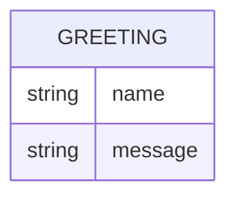

# Domain Model

Greeter has a single, stateless concept: the greeting it returns for a
requested name. There is no persistence and no relation to any other entity.

**Greeting** — `name` is the (optional) caller-supplied name; `message` is the
generated greeting text. Nothing is stored; a Greeting exists only for the
duration of one request/response.